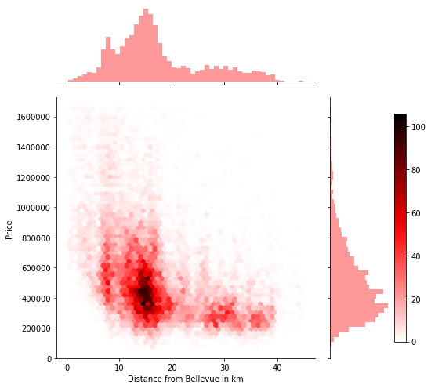
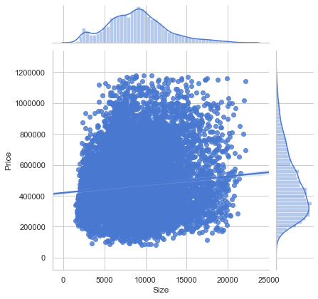
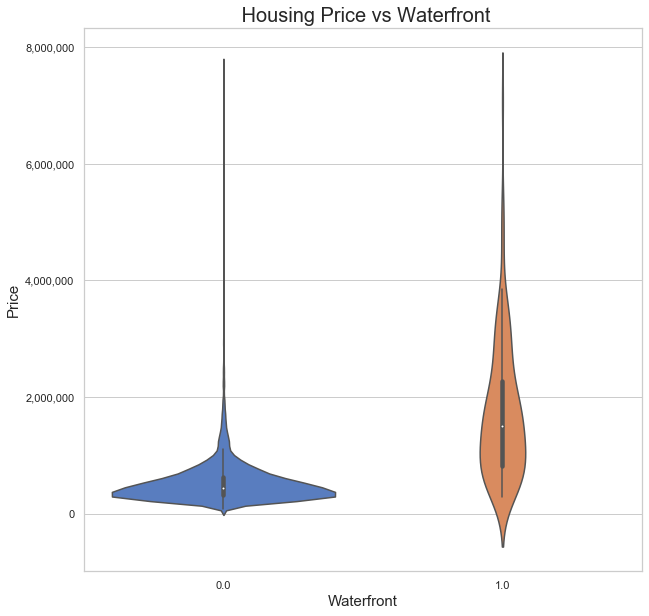
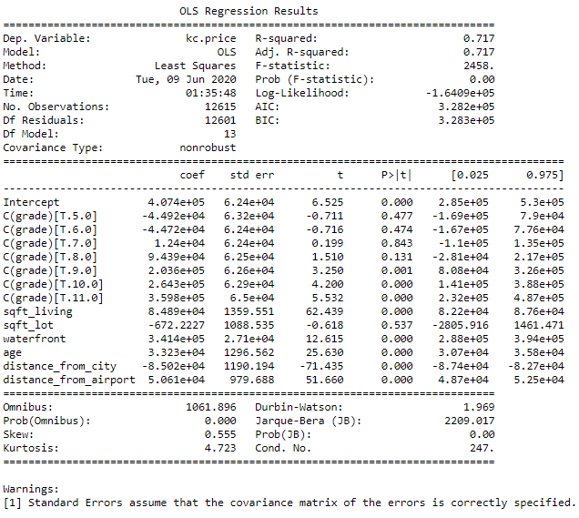
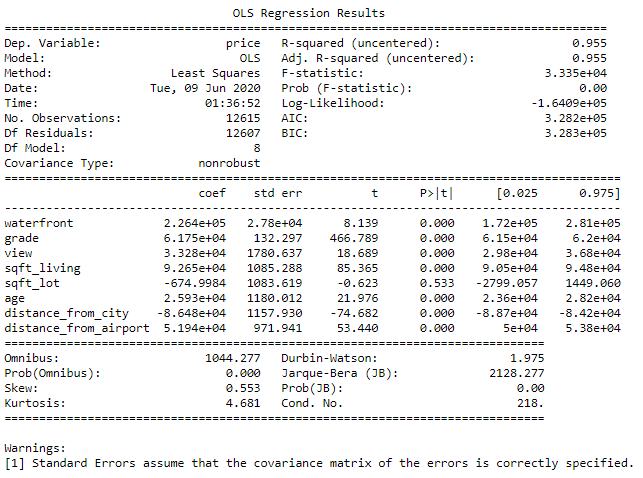
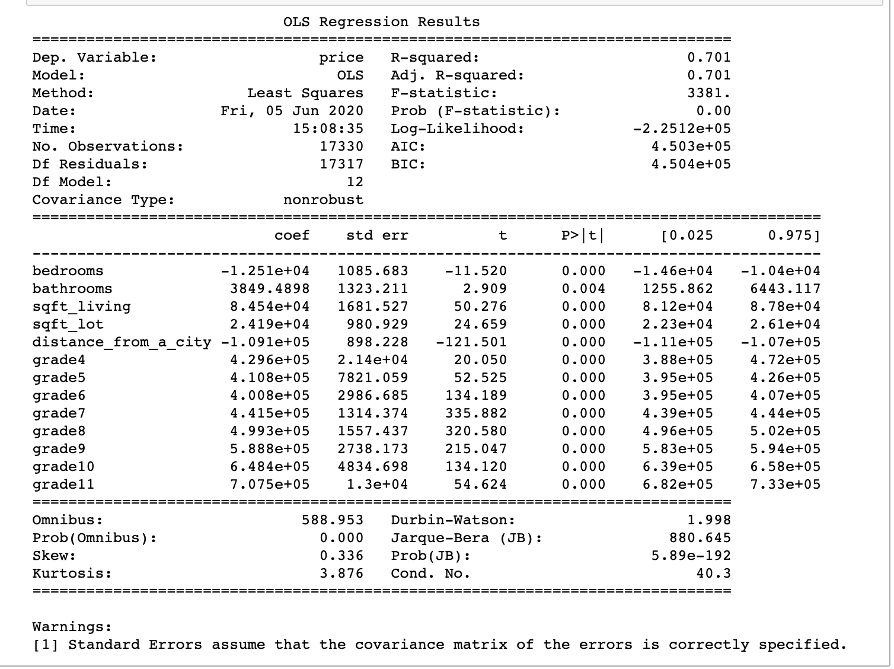

# Investigating the Housing Industry In Kings County

<a href="https://github.com/ariavathlete/dsc-mod-2-project-v2-1-onl01-dtsc-ft-041320/blob/master/Analysis%20of%20Kings%20County%20Housing%20Prices%20Presentation.pdf"> Presentation </a>
<a href="https://github.com/ariavathlete/dsc-mod-2-project-v2-1-onl01-dtsc-ft-041320/blob/master/How%20Covid-19%20On%20The%20Housing%20Industry.pdf"> Blog </a>
<a href="https://drive.google.com/file/d/1CTREwkXeR1wefkl-wycMpkm00bjvKnfz/view?usp=sharing"> Video </a>

# Table Of Contents
* [Purpose](#purpose)
* [Data Files](#data-description)
* [Question 1](#question-1)
* [Question 2](#question-2)
* [Question 3](#question-3)
* [Future Work](#future-work)
  
<!---
# = h1
## = h2
### = h3
#### = h4
##### = h5
--->

# Purpose
The goal of this research is to analyze past housing data in order to predict the sell prices of homes and answer the following questions: 
   * Q1 - How are Houses in Kings County Distributed and the effect of Zipcodes on price?
   
   * Q2 - Does distance from the city have an effect on House Price?
   
   * Q3 - Are Waterfront properties more expensive?

# Data Description
Data files used:
   * cleaned_geodata.json
   * data_correlation_gone.csv
   * datawithnewcols.csv
   * kc_house_data.csv
   * Zip_Codes.geojson

## Question 1:
## How are Houses in Kings County Distributed and the effect of Zipcodes on price?

### [EDA](./Questions/Question1.ipynb)
#### Count by Zipcode
    

#### Price by Zipcode
   

### Conclusion
By analyzing the first map, we can see that zipcodes surrounding Bellevue have more houses than zipcodes further out. Upon closer look at the second map we can see the most expensive homes are concentrated in zipcodes North of the County closer to Bellevue and the cheaper homes are located south of the county. 

### Recommendation
The North of the County has some of the most expensive properties so I belive this region is in high demand so one could expect a good amount of return by investing in real estate within ths region.

# Question 2:
## Does distance from the city have an affect on House Price?

### [EDA](./Questions/Question2.ipynb)
#### Distance from closest city v Price
   

#### Price v Size
   

#### Distance from biggest city (Seattle) v Size
   

### Conclusion
By looking at the plot we can see houses above $1 milllion are located withing 20km of Bellevue. And for homes within 50km of Seattle, Although the price/house increases the bigger the sqft, the price/sqft reduces the the further away from Seattle a house is.

### Recommendation
I'll definitely recommend investing in homes 50km from Seattle which is also about 20km from Bellevue. By doing this you'll get more space for a less price which will also translate into higher returns.

# Question 3:
## Are Waterfront properties more expensive?

### [EDA](./Questions/Question3.ipynb)
   

### Conclusion
From analyzing the violin plots we can conclude that waterfront properties are more expensive than others with a mean and median price of $1.7 million and $1.5 million. Homes without a waterfront have a mean and median price of $532,000 and $450,000 respectively.

### Recommendation
Investing in waterfront properties would definitely be a smart move given there a difference of $1 million between the average home prices of a waterfront and no waterfront property.

# [Model 1](./models/model1.ipynb)
For the first model the independent variables I used were:
   * Grade
   * Area of inside home
   * Area of parking lot
   * Presence of waterfront
   * Age of home
   * Distance from Seattle
   * Distance from the airport

The equation for this model is:
    Price = (84890 * Area inside) + (-672.2227 * Area parking lot) + (341400 * Presence of waterfront) + (33230 * Age) + (-85020 * Distance from City) + (84890 * Distance from Airport) + (-44920 * Grade 5) + (-44720 * Grade 6) + (12400 * Grade 7) + (94390 * Grade 8) + (263600 * Grade 9) + (264300 * Grade 10) + (359800 * Grade 11)

### EDA
   

## Interpretion
The model uses the price of the home based on grade, then a positive adjustment is made for the area inside, presence of a waterfront, age, distance from airport, followed by a negative adjustment for area of the parking lot and distance from the city. The R2 score means theres a 71.7% variance in price.

# [Model 2](./model/model2.ipynb)
For the first model the independent variables I used were:
   * Grade
   * View
   * Area of inside home
   * Area of parking lot
   * Presence of waterfront
   * Age of home
   * Distance from Seattle
   * Distance from the airport

The equation for this model is:
    Price = (92650 * Area inside) + (-674.9984 * Area parking lot) + (226400 * Presence of waterfront) + (25930 * Age) + (-86480 * Distance from City) + (51940 * Distance from Airport) + (61750 * Grade) + (33280 * View) 

### EDA
   

## Interpretation
The model uses the price of the home based on grade, then a positive adjustment is made for the area inside, presence of a waterfront, age, distance from airport and view, followed by a negative adjustment for area of the parking lot and distance from the city. The R2 score means theres a 95.5% variance in price.

# [Final Model](./models/Final_Model.ipynb)
For the first model the independent variables I used were:
   * Grade
   * Area of inside home
   * Area of parking lot
   * Number of bedrooms
   * Number of bathrooms
   * Distance from closest city

The equation for this model is:
    Price = (84541 * Area inside) + (24190 * Area parking lot) + (-12510 * Number of bedrooms) + (3849.4898 * Number of bathrooms) + (-109100 * Distance from City) + (429646 * Grade 4) + (410804 * Grade 5) + (400781 * Grade 6) + (441474 * Grade 7) + (499282 * Grade 8) + (588835 * Grade 9) + (648431 * Grade 10) + (707515 * Grade 11)

### EDA
   

## Interpretation
The model uses the price of the home based on grade, then a positive adjustment is made for the area inside, area of parking lot, bathrooms, followed by a negative adjustment for bedrooms and distance from the city. The R2 score means theres a 70.1% variance in price.

# Future Work
   * Zip code Feature - Create a boundary selector to enable the model to predict price depending on zip code.

   * More Data - Collate data for the passed 20 years to see how the house prices have changed and also the distinct trends, such as malls, theatres, etc. in different zip codes and how they effect the prices of homes.
   
   * Explore the effects of the distance from a city on presence and size of a basement.
